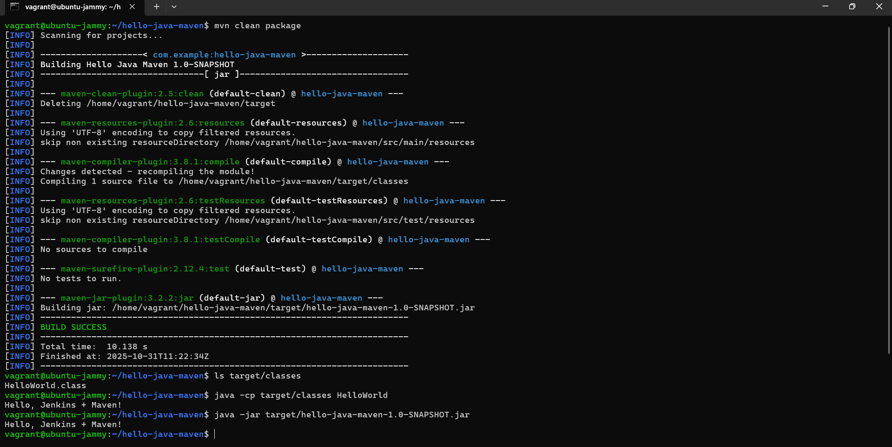
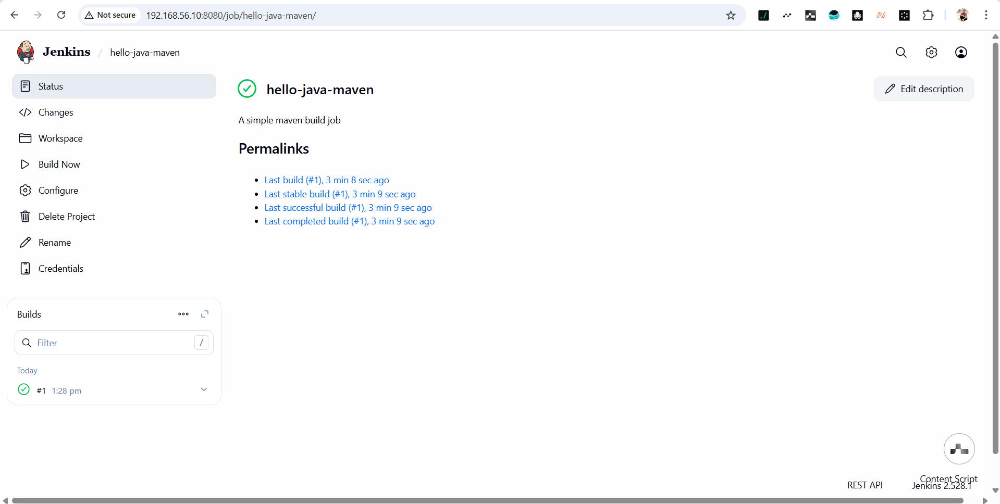
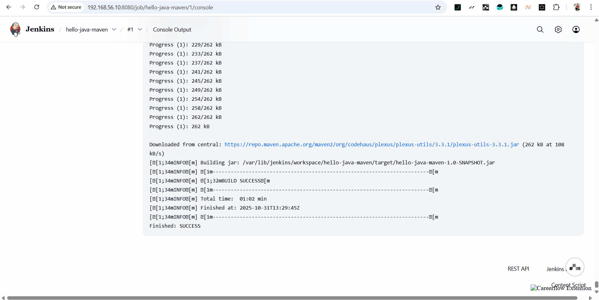

#  ElevateLab Task 8 — Run a Simple Java Maven Build Job in Jenkins

##  Objective
Learn how to use **Jenkins** to build a simple **Java application** using **Maven**, demonstrating a basic Continuous Integration (CI) workflow.

##  Tools & Technologies Used

- **Java JDK 17**
- **Apache Maven**
- **Jenkins (Freestyle Project)**
- **Git & GitHub**
- **Vagrant VM (Ubuntu 22.04)**

## Screenshot 

## Local Run Output (JAR Execution)
mvn clean package
ls target/classes
java -cp target/classes HelloWorld

## Jenkins Job Dashboard

## Jenkins Console Output (Build Success)

##  Learning Outcome

Through this task, I learned:

How to install and configure **Java JDK**, **Maven**, and **Jenkins** on Ubuntu.  
The process of creating and testing a **Maven-based Java application** locally.  
How to configure **Jenkins tool paths**, **Git integration**, and **Maven build steps**.  
